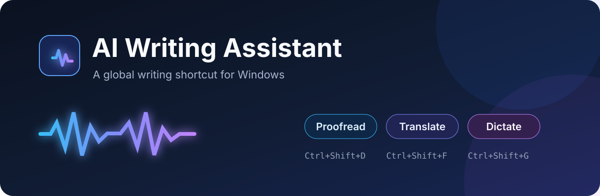
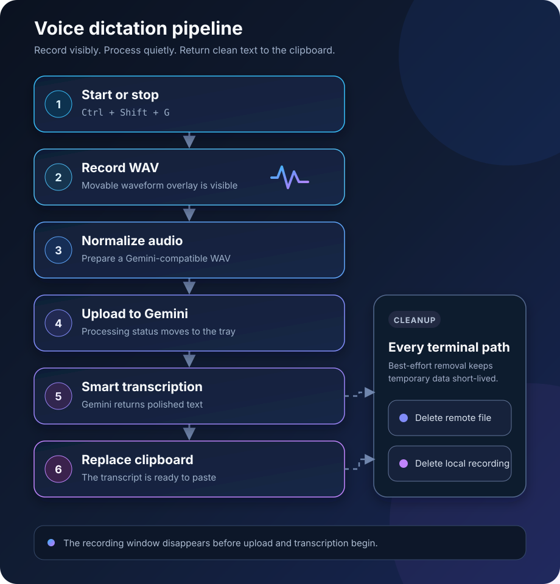

  

  
A lightweight Windows tray utility that turns global hotkeys into polished clipboard text.

  
  
  
  
  

## Why this exists

AI Writing Assistant keeps three frequent writing actions one shortcut away. It reads text from the clipboard, or records speech through the default microphone, sends only the requested input to the configured provider, and places the finished text back on the clipboard.

No editor integration is required. It works from any Windows application that can copy and paste.

## Features

| Shortcut | Action | Provider | Result |
|---|---|---|---|
| <kbd>Ctrl</kbd>+<kbd>Shift</kbd>+<kbd>D</kbd> | Proofread English text | Gemini or local Ollama | Replaces clipboard text |
| <kbd>Ctrl</kbd>+<kbd>Shift</kbd>+<kbd>F</kbd> | Translate clipboard text to English | Gemini or local Ollama | Replaces clipboard text |
| <kbd>Ctrl</kbd>+<kbd>Shift</kbd>+<kbd>G</kbd> | Start or stop voice dictation | Google Gemini Transcribe | Places transcript on clipboard |

- Movable recording overlay with a live waveform and elapsed time.
- Tray-only progress after recording stops, so transcription never covers your work.
- Separate Google credentials for text and voice billing.
- Local Ollama option for proofreading and translation.
- Retry, timeout, cancellation, cleanup, and clipboard-preservation behavior.
- English-only UI with no installer or background service.

## Install

1. Download the Windows archive from the [latest release](https://github.com/ArieSLV/ai-writing-assistant/releases/latest).
2. Extract it to a permanent folder.
3. Configure the credentials you intend to use.
4. Run <code>AiWritingAssistant.exe</code>.

The application is currently unsigned, so Windows SmartScreen may ask you to confirm the first launch. The release archive includes a SHA-256 checksum for integrity verification.

### Configure Google credentials

Run the following in PowerShell, replacing the placeholders with your own keys:

~~~powershell
[Environment]::SetEnvironmentVariable(
    "AI_WRITING_ASSISTANT_GOOGLE_API_KEY",
    "<text-actions-key>",
    "User")

[Environment]::SetEnvironmentVariable(
    "AI_WRITING_ASSISTANT_GOOGLE_VOICE_API_KEY",
    "<voice-transcription-key>",
    "User")
~~~

Restart the application after changing a user-level environment variable.

| Variable | Used for | Required when |
|---|---|---|
| <code>AI_WRITING_ASSISTANT_GOOGLE_API_KEY</code> | Proofread and Translate | Text provider is Gemini |
| <code>AI_WRITING_ASSISTANT_GOOGLE_VOICE_API_KEY</code> | Voice Dictation only | Voice Dictation is used |

Voice never falls back to the text key, and text actions never use the voice key.

### Use Ollama for text actions

Install and start [Ollama](https://ollama.com/), then open **Text Model Settings** from the tray menu. Select **Ollama**, confirm the server URL, refresh the model list, and choose a model. Voice Dictation always uses Google Gemini Transcribe.

## How voice dictation works

Press <kbd>Ctrl</kbd>+<kbd>Shift</kbd>+<kbd>G</kbd> once to start and again to stop. The recording overlay disappears immediately after stopping; upload, processing, success, and failure are represented by the tray icon and tooltip.

## Privacy and data handling

- API keys are read from environment variables and are never stored in repository or settings files.
- Temporary recordings are created outside the repository.
- The application attempts to delete the local recording and the uploaded Google file on every terminal path.
- Logs do not intentionally contain keys, transcript text, API response bodies, or audio content.
- The existing clipboard remains unchanged when recording is cancelled or transcription fails.
- Google API usage and retention remain subject to the Google project and service terms associated with your key.

## Settings and logs

The executable directory contains two runtime files after use:

- <code>AiWritingAssistant.settings.json</code> — non-secret provider and model settings;
- <code>AiWritingAssistant.log</code> — bounded diagnostic log with one rotated backup.

Do not put API keys in the settings file.

## Build from source

Requirements:

- Windows 10 or later;
- [.NET 9 SDK](https://dotnet.microsoft.com/download/dotnet/9.0);
- optional Ollama installation for local text actions.

~~~powershell
git clone https://github.com/ArieSLV/ai-writing-assistant.git
cd ai-writing-assistant
dotnet restore AiWritingAssistant.sln
dotnet test AiWritingAssistant.sln -c Release --no-restore
dotnet run --project AiWritingAssistant\AiWritingAssistant.csproj -c Release
~~~

Create a self-contained Windows package:

~~~powershell
dotnet publish AiWritingAssistant\AiWritingAssistant.csproj -c Release -r win-x64 --self-contained true -p:PublishSingleFile=true -p:IncludeNativeLibrariesForSelfExtract=true
~~~

## Contributing and security

Bug reports and focused improvements are welcome. Read [CONTRIBUTING.md](CONTRIBUTING.md) before opening a pull request. For vulnerabilities, follow [SECURITY.md](SECURITY.md) and do not create a public issue.

See [CHANGELOG.md](CHANGELOG.md) for release history.

## License

Released under the [MIT License](LICENSE).
